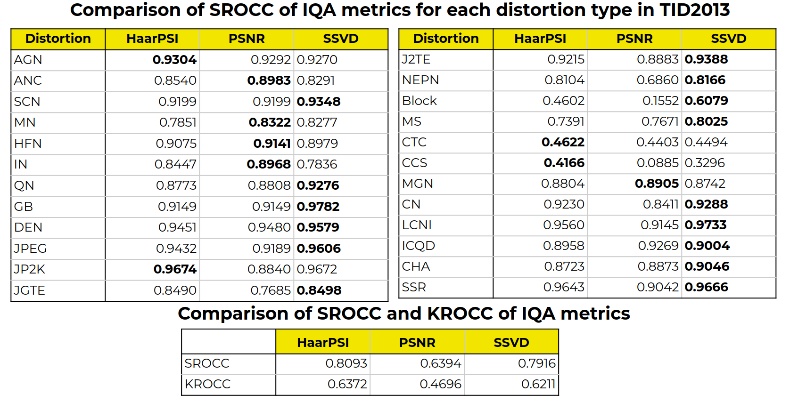

# SVD-based image quality asessment

This repository consist of the project at [NLA2020](https://github.com/oseledets/nla2020) course at Skoltech. Main results:
- Sturcture, HVS and statistical-based IQA metrics were analysed
- [SSVD](https://www.sciencedirect.com/science/article/abs/pii/S0923596519300554), [Haar](https://www.sciencedirect.com/science/article/abs/pii/S0923596517302187)and [PSNR](https://www.sciencedirect.com/science/article/abs/pii/S1047320314000091) approaches were implemented
- Algorithms effectiveness were validated on [TID2013](http://www.ponomarenko.info/tid2013.htm) dataset
[Presentation](https://drive.google.com/drive/folders/1lTx0nObzD88G_kf451hHk5WlFLSOVxfN)

